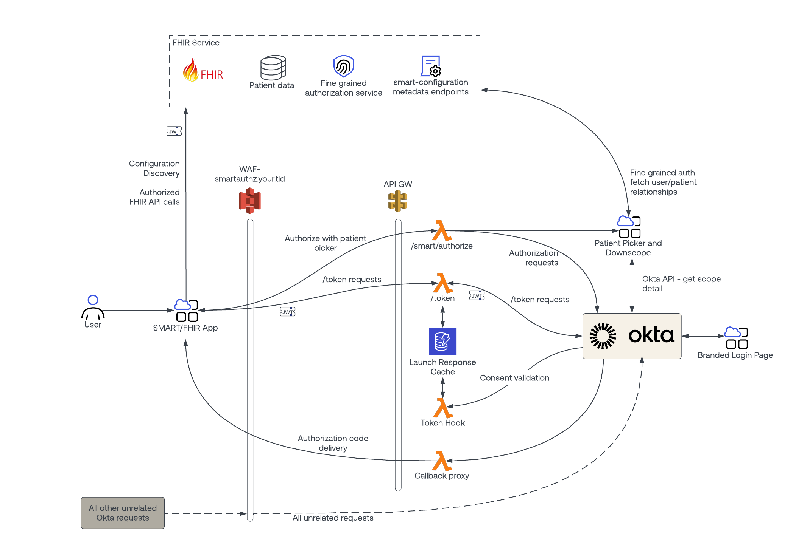
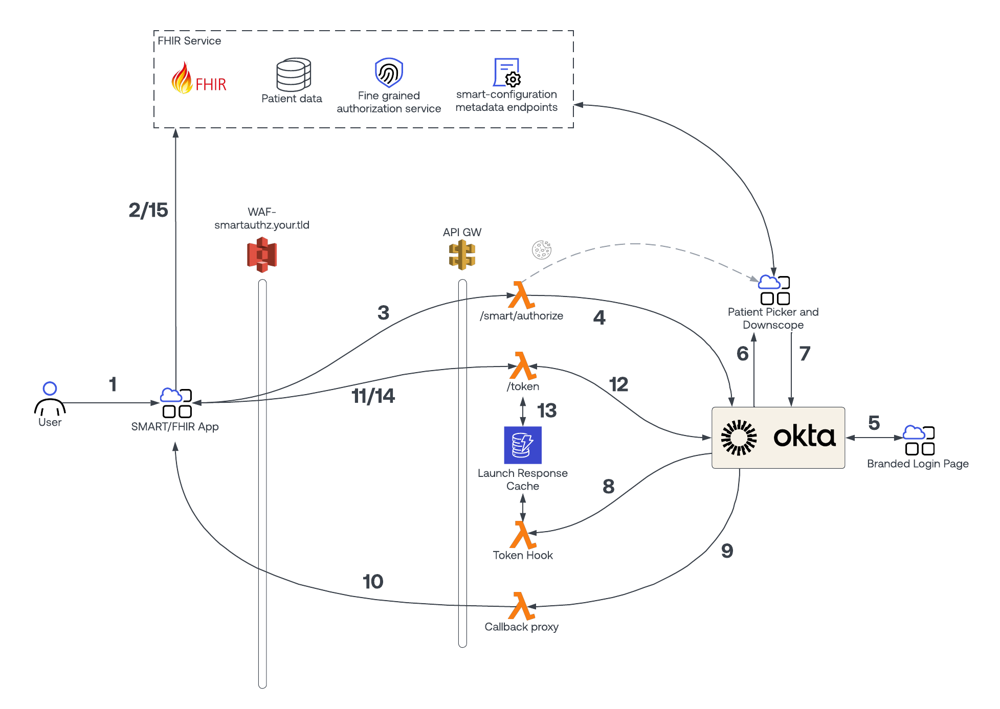
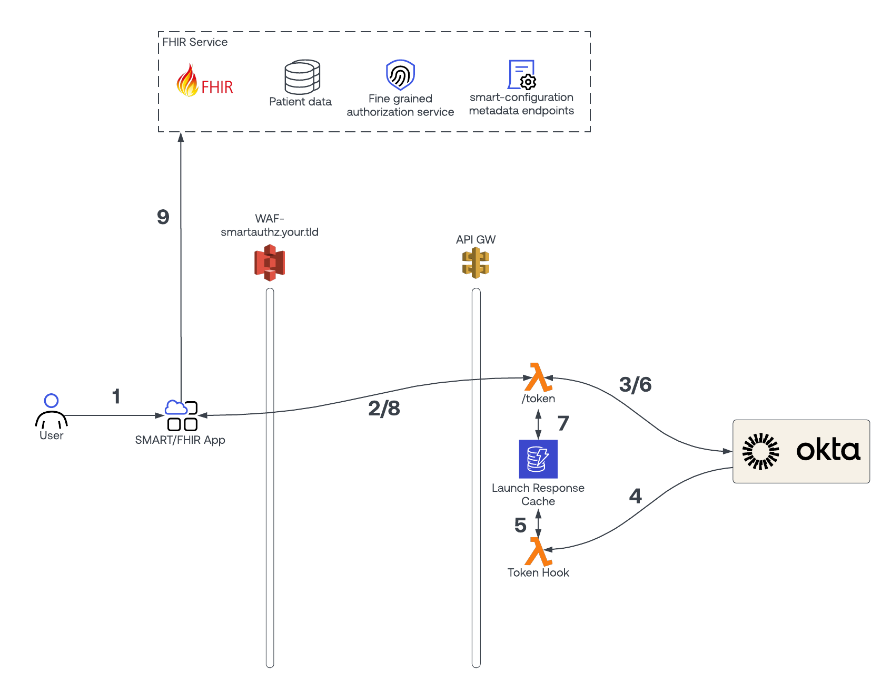

# Okta SMART on FHIR
## Okta API Access Management for SMART Authorization

[Setup a Reference SMART/FHIR Deployment Here!](./SETUP.md)

## Introduction
With the introduction of the [CMS Interoperability and Patient Access final rule](https://www.cms.gov/Regulations-and-Guidance/Guidance/Interoperability/index) in early 2020, Medicare/Medicaid/CHIP serving health insurance providers must provide a standardized API for patients to access their healthcare related data.

The required API is to be available publicly, and be open for any registered developer to create applications that invoke them, provided patient authentication and consent is provided.

While vendors in the EMR space have been providing this sort of API for several years, healthcare payers are just now being introduced to this API and it's surrounding standards.  Additionally, most off the shelf identity products owned by payers are not fully capable of handling the patient consent/authorization requirements on their own, and must be enhanced to handle some specific requirements of patient consent that are not required in other identity use cases.

This repository provides a reference implementation of a SMART compliant API security service leveraging Okta as its underlying identity platform.  

The goal is to help payers in their journey to deliver a SMART/FHIR deployment in compliance with the CMS final rule.

## Reference Implementation- Overview
The diagram below shows a high level overview of what a SMART/FHIR deployment looks like.
The reference implementation described in this document has as strong focus on the Authorization Service component, but all components with a green checkmark have at least a sample implementation.

## Reference Implementation- Standards Used

There are 2 main standards in play in the reference implementation:

**FHIR**

The FHIR standard defines the patient access API itself. The standard includes endpoint names, standard input/output parameters, and data formats.
Since the focus of this reference implementation is on API security and consent as provided by the SMART specification, a public FHIR API is used for demonstration purposes only.  This public FHIR API is hosted by [HAPI](https://hapi.fhir.org). In a real implementation, the payer organization will be responsible for implementing this API.

More details about the FHIR API specification can be found here:
[See more here](https://www.hl7.org/fhir/)

**SMART Launch Framework**

The SMART Launch Framework is the specification that is to be used to secure the requisite FHIR API, ensuring that only authorized users and services can access patient data.

The SMART specification is an extension of the OAuth2 specification, as defined in RFC 6749.  
[See more here](http://www.hl7.org/fhir/smart-app-launch/)

**SMART vs. OAuth2**
There are several requirements in the SMART specification that require additional components over/above what Okta provides as a standard OIDC/OAuth2 authorization service. All of these components are provided in the reference implementation.
* Launch parameter handling - when a SMART client requests access, it may ask for application session context, such as an active patient id to be returned from the authorization service.  The authorization service is responsible for determining the active patient record, even including a user-patient selection widget on the OAuth2 consent screen in the event that the user may view multiple patients. This behavior is not part of the OAuth2 specification, and requires special handling with Okta (or any other standard OAuth2 service).
Additionally, the SMART specification expects this session context to be returned in the /token response, ***next to*** any id/access tokens.  While this expectation is in line with RFC6749, many standard authorization servers (including Okta) do not support this practice, and instead rely on the Open ID Connect protocol to communicate application session level information.

* Well known endpoints - the SMART specification has 2 additional well known metadata endpoints that are not part of the OAuth2 specification.  These endpoints provide typical authorization server metadata, and a capabilities statement.  Sample metadata endpoints are provided as part of this reference implementation.

* Public application authentication - the SMART specification allows for 2 types of client applications- public and confidential applications.  These application types are well defined in RFC6749.  Both application types are to use the authorization code flow, which is also well defined in RFC 6749.  Since the introduction of the SMART specification, a new protocol known as PKCE has been introduced to bolster the security posture for all OAuth2 applications.
Okta, as a security company, has taken the stance that public clients may not use the authorization code flow unless PKCE is used.  To enable public SMART clients to authorize against Okta, an additional endpoint is required that will provide the requisite client authentication to Okta.

## Reference Implementation Architecture
The reference implementation is depicted below.  It leverages the [serverless](https://www.serverless.com) framework to deploy all required components as serverless endpoints.
The current implementation uses AWS products to host required functionality, but the intent in the near future is to abstract away any particular platform requirements so multi-cloud support may be achieved.

**Design Goals**
* Implement as little as possible- Tokens minted by Okta are used as-is. Only the authorization process is customized to handle the additional aspects that SMART requires.

* Stateless- No information is persisted by any of the components in this reference implementation- so no caches or databases are necessary.

* Serverless- This design is meant to be deployed to any API gateway+serverless platform, and does not require any complex server configuration or high availability considerations.

**Reference implementation supported use cases:**
* SMART Launch Framework - Standalone launch flow
* Support for launch/patient scope
* Support for custom consent, including patient selection widget
* Support for partial scope consent (OAuth2 downscoping)
* Support for public/confidential applications
* Refresh tokens for confidential applications

**Reference implementation unsupported use cases:**
* Refresh tokens for public applications- Due to security concerns. This use case would also require a refresh token cache so the client_id of the token can be determined at run time. This cache would introduce significant complexity to the design and implementation.

**Tested with clients**
These SMART enabled clients were used while developing this solution to ensure that the requirements of the SMART launch framework are correctly implemented:
* [Inferno Test Suite](https://inferno.healthit.gov/community) - Public or confidential app
* [SMART/FHIR iOS Demo](https://github.com/dancinnamon-okta/SoF-Demo) - Public app
* [Demo Patient Portal](https://github.com/udplabs/zartan) - Confidential app
* [Cerner SMART App Validator](https://smart.sandboxcerner.com/smart-app-validator-2.0/launch.html) - Public app

### Component Detail

**smart-configuration/metadata Endpoint**
These endpoints are merely static JSON files that communicate parameters about the deployment.  The only reason they are functions is to make deployment easier.

**/authorize Proxy**
The authorize proxy's purpose is to intercept SMART authorization requests, and inject a custom consent process at the beginning of the flow.

**Patient Picker and Downscope**
This screen is a single page application that will drive the custom consent process.  It is responsible for showing a patient selection dialog, scope approval/disapproval options and any other consent challenges the customer wishes to display.  The screen interfaces with Okta's API for retrieving SMART client details as well as scope details.  
The patient selection widget is populated from the fine grained authorization service.
Once the user consents, this application is responsible for re-starting the original authorization request. As it restarts the authorization request, a signed JWT is included that contains the user's selections.

**Fine Grained Authorization Service**
This service determines exactly who can view which patient records, to the fine-grained level.  This system would store complex relationships between family members, powers of attorney, etc.
In the reference implementation there is a very basic mock patient service, which can be found in mock_patient_service.js.

**OAuth2 Callback Proxy**
This endpoint is used to receive the authorization code from Okta as a result of the modified OAuth2 authorization process begun by custom consent screen. It will pass that authorization code back to the client app.

**Token Hook**
The token hook is an API endpoint that Okta calls as it processes the authorization request for the SMART client app (initiated by the custom consent screen). It has 2 purposes:
* Decorate the id/access token with the patient id selected during consent.
* Validate the signed JWT to ensure that the consent process was not bypassed in any way.

**/token Proxy**
The token proxy is what is called by the SMART client to exchange it's authorization code for an id/access token.  It serves 2 purposes:
* To retrieve the patient id from the access token, and include it alongside the access token in it's response.

* To perform private_key_jwt authentication with Okta for public applications.  A single, shared secret key is shared by all public SMART clients.  For confidential clients, client_id/client_secret from the SMART client is forwarded on to Okta.

**Launch Response Cache**
When authorizing FHIR API access using the SMART launch framework, any launch response data selected by the user at authorization time (such as a patient id in response to launch/patient scope) must also be taken into account if/when a token is refreshed using a refresh token. The launch response cache is a persistent store that is to be used to remember and replay the user's selections during the original authorization flow, that may be remembered during the refresh process. In the reference implementation a nosql database has been used that employs TTL (time to live) features so records automatically expire and are removed at roughly the same time a refresh token will expire.

## Reference Implementation Flow

1.  User accesses a SMART-enabled app.

2.  App determines authz endpoints from metadata.

3.  App opens the /authorize proxy endpoint.

4.  Authorize proxy caches original request and performs authz with patient picker app instead.

5.  User logs in with Okta.

6.  User is brought to the patient picker app. The Okta API is used to retrieve SMART client and scope details.

7.  Selected patient and approved scopes are combined with original request details and sent to Okta in a new /authorize request. Consent is sent alongside the parameters in a signed JWT using the "state" parameter.​

8.  Okta calls a token hook to validate the signed consent JWT and to insert the selected patient into the access token.​

9.  Okta returns authorization code to the callback proxy. The callback proxy validates the state parameter (the signed JWT). The callback proxy then retrieves the original OAuth2 state sent by the SMART app.

10.  The user is sent to the OAuth2 callback url of the app, with authorization code and original state.​

11.  App calls the /token proxy to obtain an access token.​

12.  /token proxy obtains the token from Okta, using a private key to perform client authentication (public apps), or by forwarding client id/secret (confidential apps).

13.  If Okta returns a refresh token to the /token proxy, the id of the refresh token, as well as any selected patient id are then stored in the launch response cache to be replayed again at refresh time.

14.  /token proxy grabs the selected patient id out of the access token, and decorates it's response JSON with the patient id if requested.

15.  App accesses the FHIR API.

## Refresh Flow

1.  User accesses a SMART-enabled app. The application presents the user with a secure way of accessing the refresh token from device memory (biometric or similar).

2.  The app invokes the /token proxy endpoint passing along the refresh token as well as client authentication (client_id/client_secret).

3. The /token proxy passes the request along to Okta to request a new id/access token.

4. Okta invokes the token hook.

5. The token hook uses the refresh token id to retrieve any runtime cached information, such as patient id or other launch response information. This information is provided to Okta to include in the newly refreshed access token.

6. Okta mints a new access token, including the retrieved cached information if any.

7. The /token proxy will again re-insert the refreshed data back into the launch response cache. This achieves 2 things:
* It will update the TTL on the record to indicate activity on the record so it will not expire.
* Depending upon Okta configuration, Okta may issue a brand new refresh token upon every refresh request (versus reusing the original one). If this occurs, a new record will be required to be inserted into the cache. This logic is the same logic from step 13 in the authorization flow above.

8. The /token proxy will grab the selected patient id out of the access token, and the response JSON will again be decorated with the patient id if requested. This is the same logic from step 14 in the authorization flow above.

9. The app accesses the FHIR API.

## Set it up yourself!
* [Reference Implementation Setup](./SETUP.md)
