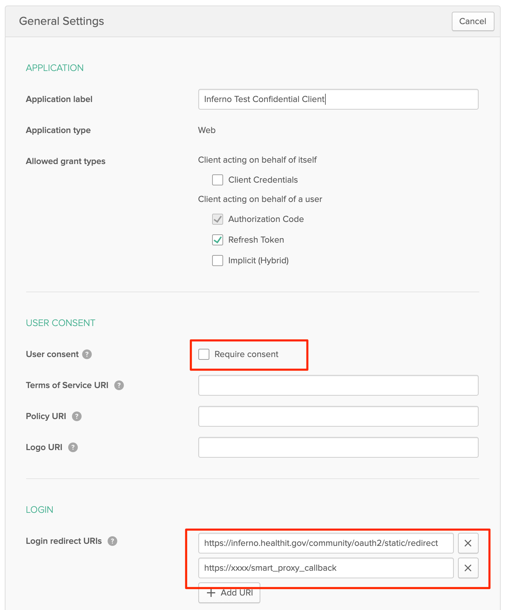

# Okta SMART on FHIR Setup Guide
## Introduction
This guide is intended to walk you through how to setup your very own reference SMART on FHIR implementation using Okta as the identity platform.
This guide focuses on the AWS platform. There will be additional guides for other cloud providers to come.
For an overview of this project and all of the components, please see here: [Project Introduction](./README.md)

*Note: This documentation has recently been overhauled to document an automated deploy process.  If you were thrown off by this change- please see the original documentation [here](https://github.com/oktadev/okta-smartfhir-docs/tree/original-v1-documentation)*

## Guide Index
* [Prerequisites](#prerequisites)
* [Automated/Guided Deployment](#automatedguided-deployment)
* [Manual Deployment](#manual-deployment)

## Prerequisites
* An Okta tenant ([Get one here free](https://developer.okta.com/signup)) 

*Note: this guide relies on setting up a custom domain on the Okta tenant. If you're using an existing Okta tenant, be sure you're comfortable with adjusting the custom domain configuration.*
* A domain name to use for your Okta/SMART authorization service (Example: smartauthz.yourdomain.tld). 

*Note: for the easiest setup, it is recommended that this domain be managed within Route53*
* Node.js 12+
* Serverless framework ([Get started here](https://www.serverless.com/framework/docs/getting-started/#via-npm))
* Postman, or other API invocation tool (not strictly required- but will make configuration easier)

## Prerequisite Setup
In this section, we'll ensure that we have our pre-requisites setup properly.

### Step 1- Install and configure the serverless framework
* [Get started here](https://www.serverless.com/framework/docs/getting-started/#via-npm)
* [Provide the platform with AWS credentials](https://www.serverless.com/framework/docs/providers/aws/guide/credentials/) 

*Note - I've found the easiest way to provide your AWS IAM credentials to the serverless framework using the "serverless config credentials" command referenced 1/2 way through the guide.*

### Step 2- Clone the reference implementation repository into your development machine filesystem.
```bash
git clone https://github.com/oktadev/okta-smartfhir-demo.git
cd okta-smartfhir-demo
```
### Step 3- Install global dependencies - in the okta-smartfhir-demo folder:
```bash
npm install
```

## Automated/Guided Deployment
To assist with the deployment of the overall solution, a guided deployment process has been created! The automated process performs the following high level tasks.
* Uses a questionnaire to collect pre-requisite information from you
    * Which FHIR server you wish to protect
    * What domain name you'd like to use for the authorization service
    * What AWS region you'd like to deploy in
* Generates configuration files for automatically deploying Okta resources as well as AWS resources
* Automatically deploying Okta configuration
* Automatically deploying AWS configuration
* Assists with any manual steps that are necessary

Overall the process is managed in a step-by-step manner with the ability to start/stop the overall process at any point. After each step in the process, the user has the ability to continue, or pause and continue at a later time.

Files managed with the deploy script:
* deploy/work/state - This is a file created by the deploy script that determines what step in the process you're in, is used to start/stop the process, and finally is used to carry configuration information between the steps.

* deploy/work/okta_org_config.'deploymentname'.json - This will will be generated as a copy of deploy/okta/okta_org_config_example.json, with proper configuration obtained during the deployment process. This may be used for future updates to Okta.

* /serverless.'deploymentname'.yml - This file will be generated as a copy of serverless.aws.example.yml, with proper configuration obtained during the deployment process.  This may be used for future updates to AWS.

### Step 1- Install deployment dependencies
```bash
cd deploy
npm install
```

### Step 2- Run the deployment script
```bash
node deploy_aws.js
```
Follow the guided process to finish your deployment!

## Manual Deployment
### Step 1- Initial Okta Configuration
There are 3 main sections to a manual deployment:
1. Initial Okta configuration
2. Deploy AWS resources
3. Finalize Okta configuration

### Step 2- Copy the serverless.aws.example.yml file- in okta-smartfhir-demo directory:
Create a clone of this file for use for your manual deployment
```bash
npm install
cp serverless.aws.yml serverless.yml
```

*Note - the layout of serverless.yml file specifies all configurable variables at the top of the file, within the "params" section.  No other configuration outside of this section should be necessary.*

### Step 3- Copy the okta_org_config_example.json file
Create a clone of this file for use in your manual deployment
```bash
cd deploy/okta
npm install
cp okta_org_config_example.json okta_org_config.json
```

### Step 4- Get an Okta API key, and fill out the okta_org_config.json file.
The details within the okta_org_config file are documented within the file. The "SUFFIX" setting will cause that value to be appended to all objects within Okta (except for claim/attribute names that must be named a certain way).

*Note: Omit the "SAMPLEUSER" fields if you do not wish to create a sample user in the Okta tenant.*

### Step 5- Run initial Okta deployment- in /deploy/okta
```bash
node deploy_okta_objects.js okta_org_config.json init
```

### Step 6- Copy output to applicable fields in serverless.yml
The output of the initial deploy is verbose and explains which fields need to go where in serverless.yml.
*Note: You should have values for all parameters except for API_GATEWAY_DOMAIN_NAME_BACKEND. We'll fill this value in step 11*

### Step 7- Configure custom domain in Okta - in /deploy/okta:
```bash
node add_custom_domain.js
```

This script will output to the screen the proper DNS configuration that is necessary for validating the domain.  It will also output the "domain id" to the screen that you'll need in the next step.

### Step 8- Validate the custom domain in Okta - in /deploy/okta:
After you've setup the proper DNS records with your DNS vendor, run:
```bash
node verify_custom_domain.js <domain ID output in step 7>
```

### Step 9- Request certificates in the AWS ACM system
Within the AWS console, request a TLS certificate for your authz domain that you've decided upon, and configured as the domain within Okta.

*Note- you must request this certificate within your deployed region AND us-east-1, if different.

### Step 10- Create the AWS custom domain - in /:
This step will configure a custom domain within the AWS API gateway that will be used in the final AWS deploy step.
```bash
serverless create_domain --verbose -c serverless.yml
```

### Step 11- Get the API GW custom domain "backend domain name" from the AWS Console
Visit: https://YOURREGION.console.aws.amazon.com/apigateway/main/publish/domain-names?region=YOURREGION

Copy the "API Gateway domain name" field into your serverless file.
It will look similar to: __uniqueid__.execute-api.__awsregion__.amazonaws.com
```yaml
API_GATEWAY_DOMAIN_NAME_BACKEND: API Gateway domain name from AWS console
```

### Step 12- Finalize AWS deployment - in /:
In this step we'll finalize the AWS deployment in AWS using the serverless framework.
```bash
serverless deploy --verbose -c serverless.yml
```

*Note this step will likely take 10-15 minutes to execute to completion.*
### Step 13- Update your authz domain CNAME record
For the final AWS/DNS step, go into the cloudfront module within the AWS console.
In the console, you should see a "distribution" for your new deployment.  You need to copy the "DomainName" field - it will be similar to: __uniqueid__.cloudfront.net.
You need to update your CNAME record that you created in step 6/7 such that your authorization server domain name points to cloudfront instead of Okta directly.


### Step 14- Finalize Okta deployment
For the final overall step, we'll finalize the Okta deployment.  In /deploy/okta:
```bash
node deploy_okta_objects.js okta_org_config.json finalize
```

## Endpoints
Once complete- the following endpoints will be available for you to provide your FHIR service:
* Issuer (if your FHIR server needs it): https://yourauthzdomain.your.tld/oauth2/{serverless.FHIR_AUTHZ_SERVER_ID}
* Authorize: https://yourauthzdomain.your.tld/oauth2/{serverless.FHIR_AUTHZ_SERVER_ID}/smart/v1/authorize
* Token: https://yourauthzdomain.your.tld/oauth2/{serverless.FHIR_AUTHZ_SERVER_ID}/v1/token
* Keys: https://yourauthzdomain.your.tld/oauth2/{serverless.FHIR_AUTHZ_SERVER_ID}/v1/keys


## Optional - create a sample user
If you want to create a sample user with a sample FHIR ID, run:
```bash
node deploy_okta_objects.js okta_org_config.json sampleuser
```

## Optional - registering additional SMART Clients
There are no major considerations for creating SMART clients.  The dynamic client registration protocol may be used, or for demonstration purposes, the Okta admin UI may be used to create a client as shown.

**_Important settings_**:
* Application Type: Web
* Allowed Grant Types: Authorization Code only
* Consent: Not required (it's handled by a custom screen - not Okta default consent screen)
* Redirect URI: 2 values shall be put here!
  * The smart_proxy_callback URL that you were provided when you deployed the Okta-SMART endpoints.
  * The actual redirect_url of the application (this is validated by the /authorize proxy)

